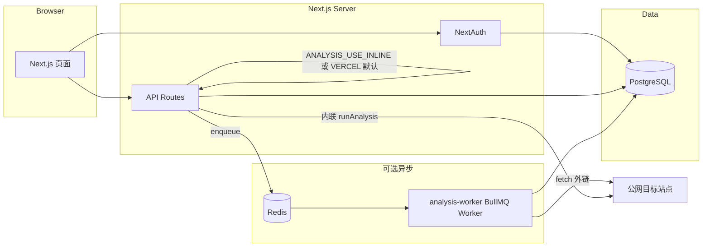

# SEO 分析器

面向中文用户的网站 SEO 自检平台：**项目 → 抓取与分析 → 评分 / 问题 / 关键词 / 趋势 / PDF 报告**。服务端抓取 HTML（Cheerio），可配置**爬取深度**；**实验室性能**优先使用本机 **Lighthouse**（需 Chrome），失败或无 Chrome 时可 fallback 到 **PageSpeed Insights API**（服务端环境变量密钥）；其余页面使用**基于首包耗时的启发式性能分**。分析任务支持 **Vercel 内联执行** 或 **Redis + BullMQ Worker**。

**线上环境（Vercel）：** <https://seo-analyzer-gk8eg7rl9-gz-s-projects.vercel.app/>

---

## 技术栈

| 层级 | 技术 |
|------|------|
| Web | Next.js 16（App Router）、React 19、Tailwind CSS 4 |
| 认证 | NextAuth（Credentials + JWT）、bcrypt |
| API | Route Handlers（`/api/*`）、Zod 校验 |
| 数据 | PostgreSQL、Prisma 7（`@prisma/adapter-pg`） |
| 队列 | BullMQ、ioredis（可选） |
| 抓取 / 分析 | cheerio、自研爬虫与 SEO 规则；可选 **lighthouse** + **chrome-launcher**；可选 **PageSpeed Insights v5**（`GOOGLE_PSI_API_KEY`） |
| 报告 | `@react-pdf/renderer`、`@fontsource/noto-sans-sc`（PDF 中文）；问题列表与 PDF 中对同类 SEO 问题做**合并展示**（影响页数、示例 URL） |

---

## 分析行为摘要（与笔试说明对齐）

| 能力 | 实现要点 |
|------|-----------|
| 爬取去重 | 规范化 URL 时 **去掉 hash（`#`）**，避免同一文档多锚点重复统计。 |
| 正文与关键词 | 统计正文前移除 `script/style/noscript/pre/code/textarea/kbd/samp` 等，减少代码站误报；关键词 token **过滤长十六进制串**。 |
| **综合 SEO 得分（百分制）** | 由 `seo-scorer` 基于 **HTML 与抓取元数据**（标题、meta、标题层级、图片 alt、链、**首包耗时阈值**、viewport、字数、体积等）扣分得到；**不直接并入**单页的 Lighthouse/PageSpeed 性能分，避免与「首包 ms」规则重复。 |
| **卡片上的「性能分」** | 与分析入口 URL **匹配的一行**（若无匹配则用**抓取列表第一条**）：优先写入 **本地 Lighthouse** 或 **PageSpeed** 的实验室分数及 FCP/LCP 等；**其余抓取页**仅用启发式（如 &lt;1s → 100）。 |
| 移动端友好 | **列表「移动友好」**主要来自是否存在 **viewport**；实验室区块为 **移动策略**下的性能指标（PSI `strategy=mobile` 或 Lighthouse LR mobile）。 |
| SSRF / 输入 | 见 `src/lib/security.ts` 与安全自查文档；`POST /api/analysis` 有深度与速率限制。 |

---

## 架构（逻辑）



- **默认（`VERCEL=1` 且未显式开队列）**：`POST /api/analysis` 创建记录后，在同一 Serverless 实例上 **内联** 调用 `runAnalysis`，并用 `waitUntil`（`@vercel/functions`）尽量延长完成概率。
- **队列模式（`ANALYSIS_USE_QUEUE=1`）**：API 只入队；须在有 **持久 Node 进程** 的环境运行 `npm run worker:analysis`，并配置 `REDIS_URL`。Vercel 上 Serverless 本身不常驻 Worker。

---

## 环境变量

复制 `.env.example` 为 `.env` 并填写。常用变量如下：

| 变量 | 说明 |
|------|------|
| `DATABASE_URL` | **必选**。PostgreSQL 连接串（生产勿用 `file:` / SQLite）。 |
| `NEXTAUTH_SECRET` | **必选**。随机长密钥。 |
| `NEXTAUTH_URL` | **必选**。与访问入口一致，如 `http://localhost:3000` 或生产 HTTPS 根路径（无尾部 `/`）。 |
| `REDIS_URL` | 队列模式：Redis 连接串。 |
| `ANALYSIS_USE_QUEUE` | 设为 `1` / `true` 时使用 BullMQ；否则在非 Vercel 或显式内联时走队列或内联逻辑（见下）。 |
| `ANALYSIS_USE_INLINE` | 设为 `1` 时强制内联分析（本地无 Redis 时常用）。 |
| `VERCEL` | Vercel 托管时由平台注入；影响默认内联 + `waitUntil` 行为。 |
| `ANALYSIS_MAX_PER_USER` | 单用户并发中的分析数上限（默认 `2`，最大钳制 20）。 |
| `ANALYSIS_QUEUE_MAX_BACKLOG` | 入队前队列积压阈值（`waiting+active+delayed`），防止压垮 Worker。 |
| `ANALYSIS_WORKER_CONCURRENCY` | Worker 并发（默认 `1`，见 `src/workers/analysis-worker.ts`）。 |
| `ANALYSIS_GLOBAL_JOBS_PER_MINUTE` | Worker 全局限速（默认 `30`/分钟）。 |
| `LIGHTHOUSE_DISABLED` | 设为 `1` 跳过**本机** `runLighthouseSummary`（仍可在配置 `GOOGLE_PSI_API_KEY` 时使用 PageSpeed）。 |
| `CHROME_PATH` | 可选；Lighthouse 使用的 Chrome/Chromium 路径。 |
| `GOOGLE_PSI_API_KEY` | 可选。Google Cloud 启用 **PageSpeed Insights API** 后的 API 密钥；**仅服务端**使用，用于 Vercel 等无 Chrome 环境获取实验室性能（不要将值提交到 Git 或暴露给前端）。 |

**数据库连接串**：若使用 `sslmode=require` / `prefer` / `verify-ca`，应用在连接前会规范为 `verify-full`，以减少 `pg` 驱动在未来大版本中的语义变更告警（与 Neon 等托管常见写法兼容；详见 `src/lib/prisma.ts`）。

---

## 本地启动

**前置**：本机或 Docker 运行 **PostgreSQL**，并创建数据库。

```bash
cp .env.example .env
# 编辑 .env：DATABASE_URL、NEXTAUTH_* 等

npm install
npx prisma migrate deploy   # 或 migrate dev（开发）
npm run dev
```

浏览器访问 `http://localhost:3000`。

### 使用队列 + Worker（贴近生产）

1. 启动 Redis（示例）：`docker run -d -p 6379:6379 redis:7-alpine`
2. `.env` 设置 `REDIS_URL`、`ANALYSIS_USE_QUEUE=1`，**不要**依赖仅内联。
3. 终端另开：

```bash
npm run worker:analysis
```

4. 应用仍用 `npm run dev`（或 `npm run start`）。`POST /api/analysis` 将只入队，由 Worker 消费并写库。

### 不使用 Redis（仅本地调试）

`.env` 设置：

```env
ANALYSIS_USE_INLINE=1
```

可不启动 Worker；分析在 API 进程内执行。

---

## 构建与部署

```bash
npm run build    # 含 prisma migrate deploy + prisma generate + next build
npm run start
```

**Vercel**

- 配置同上环境变量；数据库使用 Neon / Vercel Postgres 等 **网络可达** 的 Postgres。
- **队列**：Serverless 函数内无法长期跑 BullMQ Worker；若 `ANALYSIS_USE_QUEUE=1`，需在其他主机（如 VPS、Railway Worker）跑 `worker:analysis` 并指向同一 `REDIS_URL` 与 `DATABASE_URL`。
- **本机 Lighthouse**：依赖无头 Chrome，在 Vercel Serverless 上常 **不可用**；建议配置 **`GOOGLE_PSI_API_KEY`** 以获取入口页的实验室性能，或接受仅启发式性能分。
- **构建产物**：`next.config.ts` 中 `outputFileTracingIncludes` 将 **`lighthouse` 包内静态资源** 打入 Serverless 追踪，避免仅依赖 `serverExternalPackages` 时出现运行时 **ENOENT**（仍可能因无 Chrome 而无法完成本地 Lighthouse）。

---

## Vercel / 队列 / Lighthouse：真实限制

| 话题 | 说明 |
|------|------|
| **内联 + `waitUntil`** | 在 Vercel 上用于延长函数生命周期，但不保证任意深度抓取 + 单次 PageSpeed 必在预算内完成；仍受 **`maxDuration`（如 60s）** 与套餐限制。 |
| **冷启动** | 偶发首次请求更慢；内联长任务可能与冷启动叠加导致超时。 |
| **Chrome / 本地 Lighthouse** | `runLighthouseSummary` 使用 `chrome-launcher`；Serverless 通常 **无 Chrome**，失败则尝试 **PageSpeed**（若已配置密钥），否则仅启发式。 |
| **PageSpeed Insights** | 将**已通过 SSRF 校验的入口 URL** 发往 Google API；受配额与密钥权限影响；日志中可搜索 **`[pagespeed]`**。 |
| **队列** | BullMQ 需常驻进程；API 与 Worker **必须**共享同一 Redis 与数据库 schema。 |
| **背压** | 队列积压超过 `ANALYSIS_QUEUE_MAX_BACKLOG` 时 API 返回 503，避免无限堆任务。 |
| **评审 / 压测** | 多实例高并发场景建议用 **Redis + Worker**，避免仅依赖 Vercel 内联分析。 |

---

## 已知限制（自述）

- **每用户 / 内存限流**：见安全自查；多 Serverless 实例下限流为近似值。
- **SSRF**：重定向链未逐跳复验等缺口见 `docs/SECURITY-SELF-CHECK.md`。
- **实验室性能 coverage**：每次分析通常仅对 **入口等价的一行** 拉取完整 Lighthouse/PSI；非「整站逐 URL 全量实验室扫描」（与配额及函数时间一致）。
- **综合分 vs 性能分**：见上文「分析行为摘要」。

---

## 仓库与文档

- **AI 协作说明**：[`docs/AI-USAGE-LOG.md`](docs/AI-USAGE-LOG.md)
- **安全自查**：[`docs/SECURITY-SELF-CHECK.md`](docs/SECURITY-SELF-CHECK.md)

---
