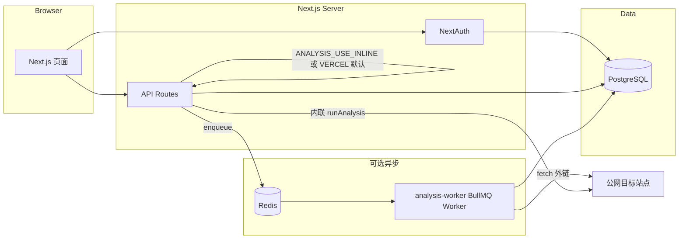

# SEO 分析器

面向中文用户的网站 SEO 自检平台：**项目 → 抓取与分析 → 评分 / 问题 / 关键词 / 趋势 / PDF 报告**。服务端抓取 HTML（Cheerio），可选 **Lighthouse**（需本机 Chrome）；分析任务支持 **Vercel 内联执行** 或 **Redis + BullMQ Worker**。

**线上环境（Vercel）：** <https://seo-analyzer-asnz0rg7b-gz-s-projects.vercel.app/>

---

## 技术栈

| 层级 | 技术 |
|------|------|
| Web | Next.js 16（App Router）、React 19、Tailwind CSS 4 |
| 认证 | NextAuth（Credentials + JWT）、bcrypt |
| API | Route Handlers（`/api/*`）、Zod 校验 |
| 数据 | PostgreSQL、Prisma 7（`@prisma/adapter-pg`） |
| 队列 | BullMQ、ioredis（可选） |
| 抓取 / 分析 | cheerio、自研爬虫与 SEO 规则、可选 lighthouse + chrome-launcher |
| 报告 | `@react-pdf/renderer`、`@fontsource/noto-sans-sc`（PDF 中文） |

---

## 架构（逻辑）



- **默认（`VERCEL=1` 且未显式开队列）**：`POST /api/analysis` 创建记录后，在同一 Serverless 实例上 **内联** 调用 `runAnalysis`，并用 `waitUntil`（`@vercel/functions`）尽量延长完成概率。
- **队列模式（`ANALYSIS_USE_QUEUE=1`）**：API 只入队；须在有 **持久 Node 进程** 的环境运行 `npm run worker:analysis`，并配置 `REDIS_URL`。Vercel 上 Serverless 本身不常驻 Worker。

---

## 环境变量

复制 `.env.example` 为 `.env` 并填写。常用变量如下：

| 变量 | 说明 |
|------|------|
| `DATABASE_URL` | **必选**。PostgreSQL 连接串（生产勿用 `file:` / SQLite）。 |
| `NEXTAUTH_SECRET` | **必选**。随机长密钥。 |
| `NEXTAUTH_URL` | **必选**。与访问入口一致，如 `http://localhost:3000` 或生产 HTTPS 根路径（无尾部 `/`）。 |
| `REDIS_URL` | 队列模式：Redis 连接串。 |
| `ANALYSIS_USE_QUEUE` | 设为 `1` / `true` 时使用 BullMQ；否则在非 Vercel 或显式内联时走队列或内联逻辑（见下）。 |
| `ANALYSIS_USE_INLINE` | 设为 `1` 时强制内联分析（本地无 Redis 时常用）。 |
| `VERCEL` | Vercel 托管时由平台注入；影响默认内联 + `waitUntil` 行为。 |
| `ANALYSIS_MAX_PER_USER` | 单用户并发中的分析数上限（默认 `2`，最大钳制 20）。 |
| `ANALYSIS_QUEUE_MAX_BACKLOG` | 入队前队列积压阈值（`waiting+active+delayed`），防止压垮 Worker。 |
| `ANALYSIS_WORKER_CONCURRENCY` | Worker 并发（默认 `1`，见 `src/workers/analysis-worker.ts`）。 |
| `ANALYSIS_GLOBAL_JOBS_PER_MINUTE` | Worker 全局限速（默认 `30`/分钟）。 |
| `LIGHTHOUSE_DISABLED` | 设为 `1` 跳过 Lighthouse（超时或无机房 Chrome 时适用）。 |
| `CHROME_PATH` | 可选；Lighthouse 使用的 Chrome/Chromium 路径。 |

---

## 本地启动

**前置**：本机或 Docker 运行 **PostgreSQL**，并创建数据库。

```bash
cp .env.example .env
# 编辑 .env：DATABASE_URL、NEXTAUTH_* 等

npm install
npx prisma migrate deploy   # 或 migrate dev（开发）
npm run dev
```

浏览器访问 `http://localhost:3000`。

### 使用队列 + Worker（贴近生产）

1. 启动 Redis（示例）：`docker run -d -p 6379:6379 redis:7-alpine`
2. `.env` 设置 `REDIS_URL`、`ANALYSIS_USE_QUEUE=1`，**不要**依赖仅内联。
3. 终端另开：

```bash
npm run worker:analysis
```

4. 应用仍用 `npm run dev`（或 `npm run start`）。`POST /api/analysis` 将只入队，由 Worker 消费并写库。

### 不使用 Redis（仅本地调试）

`.env` 设置：

```env
ANALYSIS_USE_INLINE=1
```

可不启动 Worker；分析在 API 进程内执行。

---

## 构建与部署

```bash
npm run build    # 含 prisma migrate deploy + prisma generate + next build
npm run start
```

**Vercel**

- 配置同上环境变量；数据库使用 Neon / Vercel Postgres 等 **网络可达** 的 Postgres。
- **队列**：Serverless 函数内无法长期跑 BullMQ Worker；若 `ANALYSIS_USE_QUEUE=1`，需在其他主机（如 VPS、Railway Worker）跑 `worker:analysis` 并指向同一 `REDIS_URL` 与 `DATABASE_URL`。
- **Lighthouse**：依赖无头 Chrome，在 Vercel Serverless 上常 **不可用或不稳定**；可设 `LIGHTHOUSE_DISABLED=1`，退回基于抓取耗时的启发式性能分。

---

## Vercel / 队列 / Lighthouse：真实限制

| 话题 | 说明 |
|------|------|
| **内联 + `waitUntil`** | 在 Vercel 上用于延长函数生命周期，但不保证任意深度抓取 + Lighthouse 必在预算内完成；仍受 **`maxDuration`（如 60s）** 与套餐限制。 |
| **冷启动** | 偶发首次请求更慢；内联长任务可能与冷启动叠加导致超时。 |
| **Chrome / Lighthouse** | `runLighthouseSummary` 使用本机 `chrome-launcher`；Serverless 镜像通常 **无 Chrome** 或受限，易导致失败并静默降级（分析继续，无 Lighthouse 指标）。 |
| **队列** | BullMQ 需常驻进程；API 与 Worker **必须**共享同一 Redis 与数据库 schema。 |
| **背压** | 队列积压超过 `ANALYSIS_QUEUE_MAX_BACKLOG` 时 API 返回 503，避免无限堆任务。 |

---

## 仓库与文档

- **AI 协作说明**：[`docs/AI-USAGE-LOG.md`](docs/AI-USAGE-LOG.md)
- **安全自查**：[`docs/SECURITY-SELF-CHECK.md`](docs/SECURITY-SELF-CHECK.md)

---

## 许可

本仓库用于**实习/团队笔试提交**与作品集展示；版权归作者所有，未经允许请勿将源码用于商业再发布。
